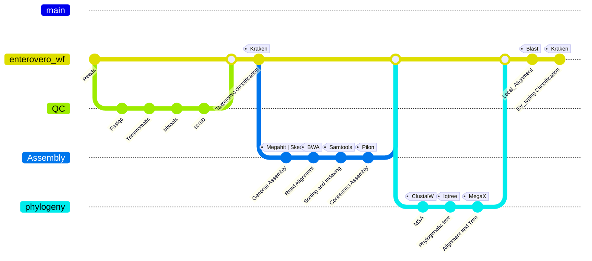

# EnteroVero
A web-deployed pipeline to seek genotyping for Enterovirus (formerly GentySpuds).

### <span style="color: red;">Disclaimer:</span> results of pipeline are intended for research use only and obtained by procedures that were not CLIA validated.
## An enterovirus is a small and enveloped mRNA virus that can causes infections in people of all ages.

## Resource requirement
For one sample the pipeline requires 8 cpus hours and approximately 2.5GB of memory. You may need to increase those numbers as you get more samples.
Iqtree and Megatree use significant amount of resources.

# Introduction
Genotyping is a way of putting a virus into categories based on similar genes.
Determining the genotype of viruses is important not only in epidemiology studies, but also for efficient vaccine development
and treatment.       

# Workflow

   
# Software Tools implemented/Dependencies
FASTQC, trimmomatic, bbtools, sra_human_scrubber, Multiqc, Megahit, skesa, kraken, bwa, samtools, pilon, quast, Blast, clustalo, iqtree, MegaX etc. 

# Installation
### Clone repository
```
git clone https://github.com/BPHL-Molecular/enteroVero.git
```
### Create your conda environment
Use the provided enterovero_env.yml file to execute the command below, and a conda environment named ENTEROVERO will be created.    
```
conda env create -f enterovero_env.yml
```

# Usage
EnteroVero takes as input raw sequencing reads in FASTQ format, and can process gzipped files directly.  
Make sure all your fastq files are stored in one directory. The databases are stored in the share drive in blue on HPG. <br />
Activate the created conda environment <br />
```
conda activate ENTEROVERO
```
The basic command to run the pipeline is set below. <br />   
```
nextflow run enterovero_wf -params-file params.yaml -resume
```

For efficiency, run the above command within the supplied sbatch script. Check the script first to update email and paths. Create this directory <<nextflow_temp>> and edit the path to save the nextflow temporary storage/cache directory.

```
sbatch vero_jobScheduler.sh
``` 
Note the two Excel files in the directory are provided to annotate phylogenetic trees. "EV_RV_vp1GenProt_v2ed.xlsx" works with vp1_nucl01 while EV_RV_vp1GenProt_v3.xlsx with "vp1_nucl02" genomes of the capsid protein vp1. 
## Overview of the arguments
- <mark>nextflow</mark> is a workflow programming language that allows reproducibility, portability, scalability of large datasets analysis.
- <mark>enterovero_wf.nf</mark> is the main script workflow to run the pipeline.  
- <mark>params.yaml</mark> indicates all the required input files along with their paths.
- <mark>asbler</mark> is an optional argument (in the params.yaml file) to choose an assembly software (megahit or skesa). Megahit is the default assembler - when <mark>asbler</mark> is not used. Skesa requires higher sequencing depth, thus some samples may be left out.
- The file params.yaml provides a convenient way to feed the workflow with the input data, especially when there are multiple parameters as it is the case.

## Pipeline Outputs
The main output directory contains a sum-report file, which is a table with the last two columns being the Enterovirus genotyping result and percentage for each sample. There is a subdirectory for each sample that stores various files including annotated phylogenetic trees, Blast alignment report, average nucleotide identity etc.